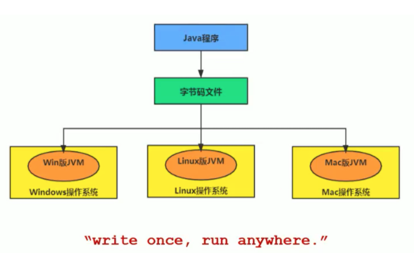

# JVM体系结构

## 1、内存与垃圾回收

### 1.1 前言

#### 1.1.1 Java程序结构


#### 1.1.2 计算机系统体系


#### 1.1.3 思考维度

1. 应该如何让我的系统更快？
2. 如何避免系统出现瓶颈？

- 参与现有系统的性能优化，重构，保证平台性能和稳定性
- 根据业务场景和需求，决定技术方向，做技术选型
- 能够独立架构和设计海量数据下高并发分布式解决方案，满足功能和非功能需求
- 解决各类潜在系统风险，核心功能的架构与代码编写
- 分析系统瓶颈，解决各种疑难杂症，性能调优等


#### 1.1.4 Java 与 C++

- C++需要自己手动分配内存和垃圾回收，Java中交给了JVM进行内存分配和垃圾回收，从而提高了开发效率；

- 同时，了解JVM底层内存结构、工作机制，是设计高可扩展性应用和高效率应用的前提。


#### 1.1.5 Java跨平台

- Java语言通过编译器编译成字节码文件，JVM只关心字节码文件，不关心Java语言；

- 也就是说只要是一个有效地字节码文件，JVM都可以处理，而不一定非要是Java编译；

- 还有许多其它语言可以编译成字节码文件，然后通过JVM进行处理；

  




java的跨平台是通过编译后的字节码文件来实现，由于不同的系统下安装了相应的java虚拟机，jvm对java文件编译后的字节码文件进行翻译成机器码，从而发挥作用。

#### 1.1.6 多语言混合编程

- Java平台上的多语言混合编程成为主流，通过特定领域的语言去解决特定领域的问题来应对软件项目开发需求。
- 试想一下，在一个项目之中，并行处理用Clojure语言编写，展示层使用JRuby/Rails，中间层则是Java，每个应用层都将使用不同的编程语言来完成，而且，接口对每一层的开发者都是透明的，各种语言之间的交互不存在任何困难，就像使用自己语言的原生API一样方便，**因为它们最终都运行在一个虚拟机之上。**
- 对这些运行于Java虚拟机之上、Java之外的语言，来自系统级的、底层的支持正在迅速增强，以JSR-292为核心的一系列项目和功能改进（如DaVinci Machine项目、Nashorn引擎、InvokeDynamic指令、java.lang.invoke包等），推动Java虚拟机从"Java语言的虚拟机"向"多语言虚拟机"的方向发展。
  

#### 1.1.7 Java大事件

- 1990年，在Sun计算机公司中，由Patrick Naughton、MikeSheridan及James Gosling领导的小组Green Team，开发出的新的程序语言，命名为Oak，后期命名为Java
- 1995年，Sun正式发布Java和HotJava产品，Java首次公开亮相。
- 1996年1月23日Sun Microsystems发布了JDK 1.0。
- 1998年，JDK1.2版本发布。同时，Sun发布了JSP/Servlet、EJB规范，以及将Java分成了J2EE、J2SE和J2ME。这表明了Java开始向企业、桌面应用和移动设备应用3大领域挺进。
- 2000年，JDK1.3发布，**Java HotSpot Virtual Machine正式发布，成为Java的默认虚拟机。**
- 2002年，JDK1.4发布，古老的Classic虚拟机退出历史舞台。
- 2003年年底，Java平台的scala正式发布，同年Groovy也加入了Java阵营。
- 2004年，JDK1.5发布。同时JDK1.5改名为JavaSE5.0。
- 2006年，JDK6发布。同年，Java开源并建立了OpenJDK。顺理成章，Hotspot虚拟机也成为了OpenJDK中的默认虚拟机。
- 2007年，Java平台迎来了新伙伴Clojure。
- 2008年，oracle收购了BEA，得到了**JRockit虚拟机**。
- 2009年，Twitter宣布把后台大部分程序从Ruby迁移到Scala，这是Java平台的又一次大规模应用。
- 2010年，Oracle收购了Sun，获得Java商标和最真价值的HotSpot虚拟机。此时，Oracle拥有市场占用率最高的两款虚拟机HotSpot和JRockit，并计划在未来对它们进行整合：HotRockit
- 2011年，JDK7发布。在JDK1.7u4中，正式启用了新的垃圾回收器G1。
- 2017年，JDK9发布。将G1设置为默认GC，替代CMS，同年，IBM的J9开源，形成了现在的Open J9社区
- 2018年，Android的Java侵权案判决，Google赔偿Oracle计88亿美元
- 同年，Oracle宣告JavagE成为历史名词JDBC、JMS、Servlet赠予Eclipse基金会
- 同年，JDK11发布，LTS版本的JDK，**发布革命性的ZGC，调整JDK授权许可**
- 2019年，JDK12发布，加入RedHat领导开发的**Shenandoah GC**


目前三大JVM：

1、HotSpot    

2、JRockit

3、Open J9

JDK版本：协议不同

- OpenJDK： 半年维护期，
- OracleJDK：3年，商用付费


#### 1.1.8 虚拟机

##### 1）虚拟机概念

虚拟机是一款软件，用来执行执行虚拟计算指令，虚拟机分为系统虚拟机和程序虚拟机；

**系统虚拟机：**VMware、Virtual Box等，对物理计算机的仿真。

**程序虚拟机：** JVM虚拟机，专为执行计算机程序设计。

无论是系统虚拟机还是程序虚拟机，在上面运行的软件都被限制于虚拟机提供的资源中。

##### 2）Java虚拟机-JVM

- 二进制字节码文件的运行环境

- Java虚拟机是一台执行Java字节码的虚拟计算机，它拥有独立的运行机制，其运行的Java字节码也未必由Java语言编译而成。
- JVM平台的各种语言可以共享Java虚拟机带来的跨平台性、优秀的垃圾回器，以及可靠的即时编译器。
- Java技术的核心就是Java虚拟机，因为所有的Java程序都运行在Java虚拟机内部。
- Java虚拟机就是二进制字节码的运行环境，负责装载字节码到其内部，解释/编译为对应平台上的机器指令执行。每一条Java指令，Java虚拟机规范中都有详细定义，如怎么取操作数，怎么处理操作数，处理结果放在哪里。

**特点：**

1、一次编译，到处运行

2、自动内存管理

3、自动垃圾回收

#### 1.1.9 Jvm的位置

- JVM运行在操作系统上，与硬件没有直接的交互


- Java的整体结构


#### 1.1.10 JVM整体结构


#### 1.1.11 Java代码执行流程


#### 1.1.12 JVM架构模型

Java编译器输入的指令流有两种：

1、基于栈的指令集架构

2、基于寄存器的指令集架构

**基于栈的指令集架构特点：**

- 设计和实现更简单，适用于资源受限的系统
- 避开了寄存器的分配难题：使用零地址指令方式分配（因为使用栈的结构，只需要在栈顶pushu入、pop出）
- 指令流中的指令大部分是零地址指令，其执行过程依赖于操作栈。**指令集更小（八位进对齐）**，但指令多，编译器容易实现
- 不需要硬件支持，可移植性更好，更好实现跨平台

**基于寄存器架构的特点：**

- 典型的应用是x86的二进制指令集：比如传统的PC以及Android的Davlik虚拟机。
- **指令集架构则完全依赖硬件，与硬件的耦合度高，可移植性差**
- **性能优秀和执行更高效**
- 花费更少的指令去完成一项操作
- 在大部分情况下，基于寄存器架构的指令集往往都以一地址指令、二地址指令和三地址指令为主，而基于栈式架构的指令集却是以零地址指令为主


**eg：**两种架构的举例

同样执行2+3这种逻辑操作，其指令分别如下：

- 基于栈的计算流程（以Java虚拟机为例）

指令多，指令集小

```bash
iconst_2 //常量2入栈
istore_1
iconst_3 // 常量3入栈
istore_2
iload_1
iload_2
iadd //常量2/3出栈，执行相加
istore_0 // 结果5入栈
```

- 基于寄存器的计算流程

指令少，指令集大

```bash
mov eax,2 //将eax寄存器的值设为2
add eax,3 //使eax寄存器的值加3
```


## 2、字节码与类的加载


## 3、性能监控与调优


